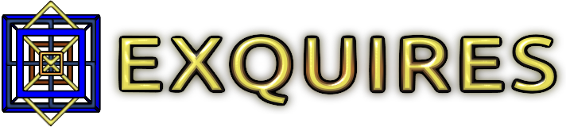

**********************************************************************
The **EXQUIRES** (EXtensible QUantitative Image RESampling) Test Suite
**********************************************************************

----

:Website: `<http://exquires.ca>`_
:PyPI:    `<http://pypi.python.org/pypi/exquires>`_
:GitHub:  `<http://github.com/aturcotte/exquires>`_
:License: `BSD 2-Clause License`_
:Authors: `Adam Turcotte`_ and `Nicolas Robidoux`_

.. _BSD 2-Clause License: http://www.opensource.org/licenses/bsd-license.php
.. _Adam Turcotte: mailto:adam.turcotte@gmail.com
.. _Nicolas Robidoux: mailto:nicolas.robidoux@gmail.com

----

The **EXQUIRES** test suite is an open source framework for assessing the
accuracy of image upsampling methods. **EXQUIRES** can also be used to compare
image difference metrics, or to measure the impact of various factors,
including test image selection and properties, downsampler choice, resizing
ratio, etc.

.. toctree::
    :maxdepth: 3

    about
    README
    install
    usage
    programs
    modules
    license
    changelog
    todo
